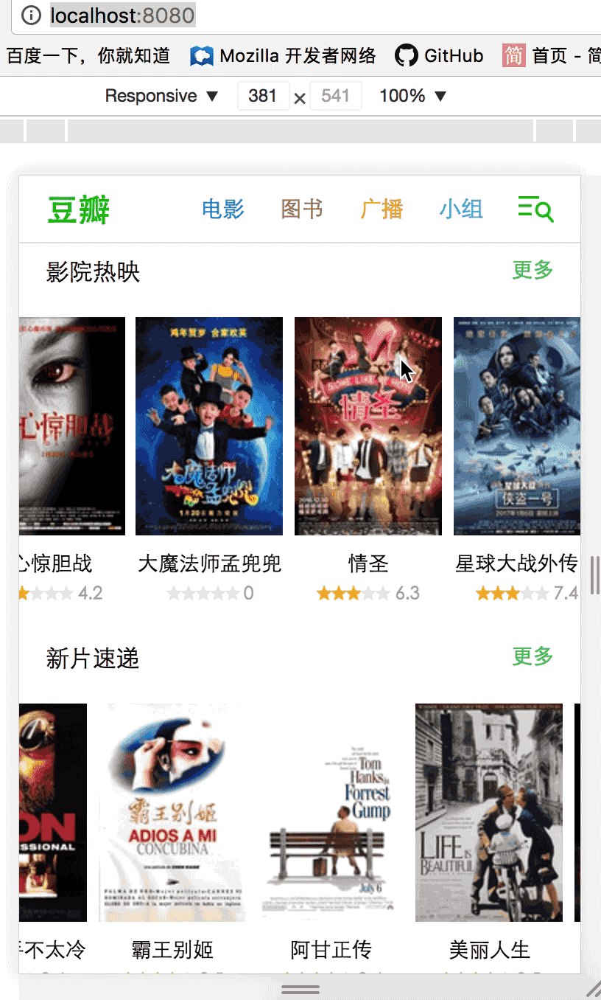

# db-webapp

> vue2.0 + vue-router + vue-resource  简单实现实现豆瓣webapp

目前实现了movie首页，路由切换，数据均来自[豆瓣API](https://developers.douban.com/wiki/?title=guide)

demo地址：
[https://liangxiaoxin.github.io/douban-webapp/](https://liangxiaoxin.github.io/douban-webapp/)

demo演示：



主路由：

	// 路由配置
	  routes: [
	    {
	      path: '/',
	      component: movie
	    },
	    {
	      path: '/movie',
	      component: movie
	    },
	    {
	      path: '/book',
	      component: book
	    },
	    {
	      path: '/broadcast',
	      component: broadcast
	    },
	    {
	      path: '/group',
	      component: group
	    }
	  ]

第三方插件：better-scorll.js 实现左右滑动

## Build Setup

``` bash
# install dependencies
npm install

# serve with hot reload at localhost:8080
npm run dev

# build for production with minification
npm run build

# run unit tests
npm run unit

# run all tests
npm test
```
